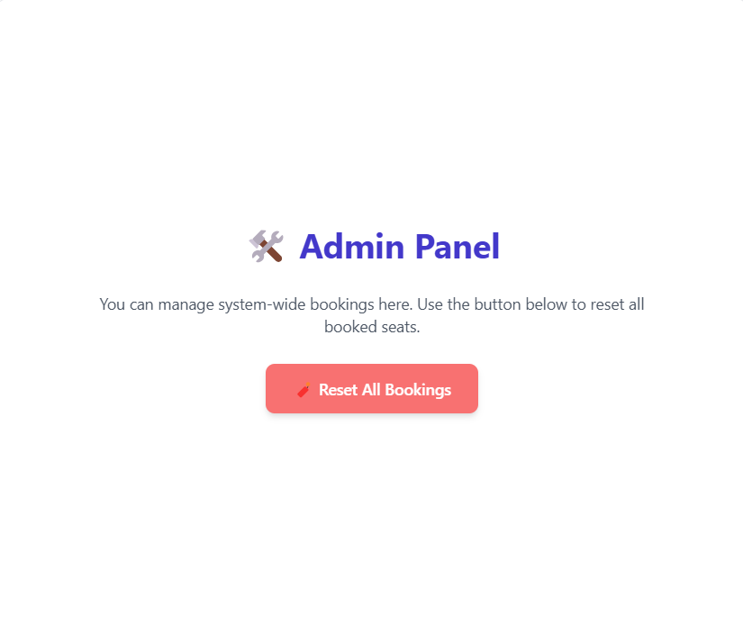
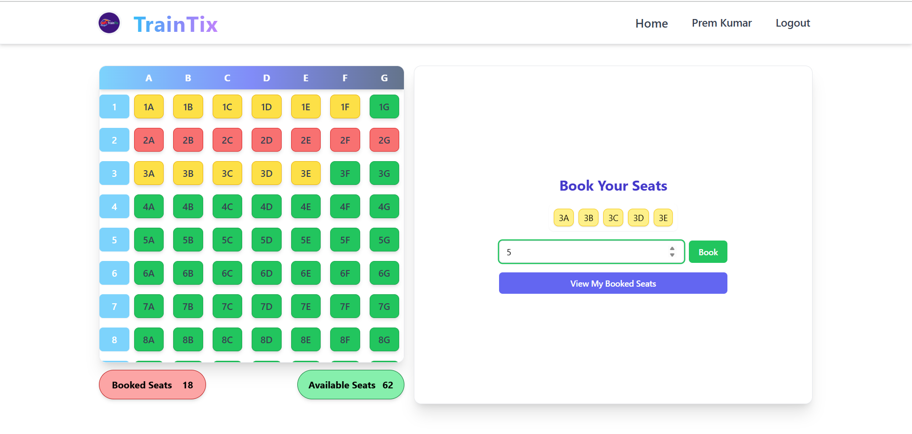

# 🚆 TrainTix - Smart Seat Reservation System

TrainTix is a full-stack web application for booking train seats with smart allocation logic and role-based access (Admin/Customer). Built as part of the Workwise SDE 1 Assignment.


## 🚀 Live App
Visit the deployed app: https://train-tix.onrender.com/

## Features

- 🔐 **User Authentication** (Login/Signup)
- 🪑 **Smart Seat Booking**
  - Books closest available and adjacent seats
  - Max 7 seats per booking
- 🎯 **Role-Based Access**
  - Admin can reset all bookings
- 💺 **Live Seat Layout**
  - Green: Available  
  - Red: Booked by others  
  - Yellow: Booked by you
- ♻️ **Cancel Seats**
  - Cancel specific or all booked seats
- 💾 **Persistence**
  - Bookings stored in PostgreSQL
  - Redux-managed global state
- 💻 **Fully Responsive UI**

---

## 🛠 Tech Stack

| Frontend   | Backend        | Database   | State Management |
|------------|----------------|------------|------------------|
| React.js   | Node.js + Express | PostgreSQL | Redux Toolkit  |

---

## 🖼 Screenshots

| Booking Panel | Admin Panel | Seat Layout |
|---------------|-------------|--------------|
|  |  |  |

---

---

## 🧪 How to Run Locally

### 1. Clone Repo
```bash
git clone https://github.com/premiitr/traintix.git
cd traintix
```

### 2. Setup Frontend
```bash
cd client
npm install
npm start
```

### 3. Setup Backend
```bash
cd server
npm install
node server.js
```

### 4. PostgreSQL Setup
```sql
CREATE DATABASE traintix;

CREATE TABLE users (
  id SERIAL PRIMARY KEY,
  name TEXT,
  email TEXT UNIQUE,
  password TEXT,
  booked_seats TEXT[]
);
```

---

## 📦 API Endpoints

| Method | Endpoint         | Description               |
|--------|------------------|---------------------------|
| POST   | `/register`      | Register new user         |
| POST   | `/login`         | Login existing user       |
| POST   | `/book`          | Book seats                |
| POST   | `/cancel`        | Cancel user’s booked seats |
| POST   | `/reset_all`     | Admin resets all bookings |
| GET    | `/booked_seats`  | Get all booked seats      |

---


---
## 📁 File Structure
```bash
|traintix
│
├── /frontend                    # Frontend React app
│   ├── /public                # Public assets (index.html, etc.)
│   ├── /src                   # React source code
│       ├── index.js               # Entry point for the app
│   ├── package.json           # Frontend dependencies
│
├── /backend                   # Backend Node.js + Express app
│   ├── /controllers           # API endpoint controllers
│   ├── /models                # Database models
│   ├── /routes                # API route definitions
│   ├── server.js              # Main server file
│   ├── package.json           # Backend dependencies
│
└── README.md                  # This file
```
---

---
## 🌍 Using Environment Variables
### 1. Frontend Environment Variables
In the frontend/.env file, you can define any necessary variables for the React app, such as the backend API URL:
```bash
REACT_APP_API_URL="https://<your-backned>.onrender.com" or your Backend API
```
### 2. Backend Environment Variables
In the backend/.env file, you can define the following backend variables:
```bash
DB_HOST=your_host_name
DB_USER=your_postgres_user
DB_PASSWORD=your_postgres_password
DB_NAME=your_db_name
```
### 3. Using Environment Variables
* **Frontend** : Variables defined in ```frontend/.env``` will be available as ```process.env.REACT_APP_API_URL``` within your React code.
* **Backend** : Variables defined in ```backend/.env``` can be accessed in your Node.js code using ```process.env.<VARIABLE_NAME>```.

## 👨‍💻 Admin Credentials

```bash
Email: admin@traintix.com
Password: any
```
## 🧑‍💻 Developed by

Prem | [GitHub @premiitr](https://github.com/premiitr)
